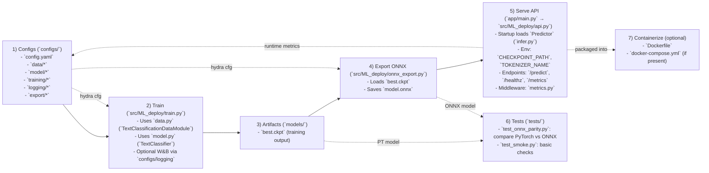

### Step-by-step flow (main codebase only)

```mermaid
flowchart LR
  %% Step 1: Config
  A["1) Configs (`configs/`)\n- `config.yaml`\n- `data/*`\n- `model/*`\n- `training/*`\n- `logging/*`\n- `export/*`"]

  %% Step 2: Training
  B["2) Train (`src/ML_deploy/train.py`)\n- Uses `data.py` (`TextClassificationDataModule`)\n- Uses `model.py` (`TextClassifier`)\n- Optional W&B via `configs/logging`"]

  %% Step 3: Artifacts
  C["3) Artifacts (`models/`)\n- `best.ckpt` (training output)"]

  %% Step 4: ONNX Export
  D["4) Export ONNX (`src/ML_deploy/onnx_export.py`)\n- Loads `best.ckpt`\n- Saves `model.onnx`"]

  %% Step 5: Serve API
  E["5) Serve API (`app/main.py` → `src/ML_deploy/api.py`)\n- Startup loads `Predictor` (`infer.py`)\n- Env: `CHECKPOINT_PATH`, `TOKENIZER_NAME`\n- Endpoints: `/predict`, `/healthz`, `/metrics`\n- Middleware: `metrics.py`"]

  %% Step 6: Tests
  F["6) Tests (`tests/`)\n- `test_onnx_parity.py`: compare PyTorch vs ONNX\n- `test_smoke.py`: basic checks"]

  %% Step 7: Container (optional)
  G["7) Containerize (optional)\n- `Dockerfile`\n- `docker-compose.yml` (if present)"]

  %% Edges
  A --> B
  B --> C
  C --> D
  D --> E
  A -. hydra cfg .-> B
  A -. hydra cfg .-> D
  C -. PT model .-> F
  D -. ONNX model .-> F
  E -. runtime metrics .-> A
  E -. packaged into .-> G
```

